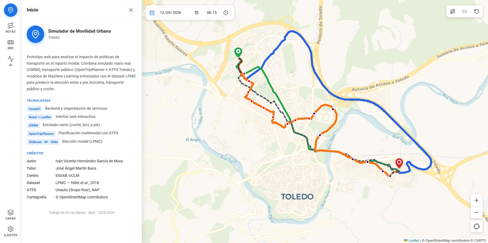

# Simulador de Movilidad Urbana para Toledo

> **English version:** [README.md](./README.md)

Simulador web de escenarios de movilidad urbana para Toledo. Calcula rutas
multimodales, visualiza la red de transporte público y predice la elección
modal mediante aprendizaje automático, todo dentro de un único stack Docker
Compose.

Desarrollado como Trabajo Fin de Máster en la Universidad de Castilla-La
Mancha (ESIIAB, UCLM).



---

## Funcionalidades

La interfaz se articula en torno a un rail lateral fijo que da acceso a seis
paneles funcionales superpuestos sobre un mapa de Toledo a pantalla completa.

**Panel Rutas**
- Establece el origen y el destino haciendo clic derecho en el mapa o editando
  directamente las coordenadas en el panel.
- Calcula simultáneamente rutas en coche, bicicleta y a pie mediante tres
  instancias locales de OSRM (polilíneas coloreadas con contorno de contraste
  para colores claros).
- Planifica trayectos en transporte público con OpenTripPlanner 2.x (GTFS
  urbano de Toledo, 22 feb – 22 may 2026); navega entre alternativas e
  inspecciona un diagrama parada a parada con horas de paso, fly-to en el mapa
  y marcadores de transbordo.
- Auto-recálculo: tras el primer cálculo, cambiar cualquier extremo O/D
  relanza todas las peticiones automáticamente.

**Panel Red GTFS**
- Explora las líneas de bus en un acordeón agrupado por nombre de línea; cada
  línea muestra su color oficial, ambos sentidos y un diagrama de paradas estilo
  cartel de línea.
- Tabla de horarios con resaltado de la próxima salida: pasadas en gris,
  futuras en azul, la próxima en negrita. Avisa si la línea no circula en la
  fecha seleccionada.

**Panel Predicción IA**
- Tres perfiles de viaje predefinidos — Commuter, Estudiante, Familiar — que
  autocompletan el formulario y ajustan también la fecha y la hora globales al
  escenario que representan.
- Inferencia de elección modal (XGBoost, Random Forest o DNN) con probabilidades
  para los cuatro modos: a pie, bicicleta, transporte público y coche.
- Compara los tres modelos sobre el mismo escenario, o inspecciona el vector de
  características completo (valores originales y escalados) en un modal de depuración.

**Panel Capas**
- Seis capas de fondo: CartoDB Voyager (por defecto), CartoDB Positron,
  OpenStreetMap, OpenTopoMap, Esri World Imagery (satélite) y ortofoto PNOA
  (IGN España, 25 cm de resolución en zona urbana, sin token necesario).

**Panel Ajustes**
- Mostrar u ocultar las paradas de bus en el mapa.
- Selector de modelo dinámico: cualquier par `{nombre}_lpmc.joblib` +
  `{nombre}_lpmc_scaler.joblib` en `lpmc/models/` es detectado en tiempo de
  ejecución sin reiniciar ningún contenedor.
- Instrucciones colapsables para añadir modelos propios (interfaz sklearn
  `predict_proba` o PyTorch mediante `TorchModalWrapper`).

**Control global de fecha y hora**
- Un único selector de fecha y hora fijo en la esquina superior izquierda del
  mapa gobierna todos los paneles a la vez: itinerarios OTP, horarios GTFS y
  perfil de viaje de la IA. Acotado al rango válido del feed (22 feb – 22 may 2026).

**Controles del mapa**
- Zoom fraccionario (pasos de 0,25) mediante botones React propios que
  sustituyen a los controles nativos de Leaflet. Botones de limpieza
  independientes para rutas, capa de bus o todo incluidos los puntos O/D.
- Menú contextual (clic derecho): establecer origen, establecer destino o
  copiar coordenadas al portapapeles.

---

## Requisitos previos

| Requisito | Notas |
|---|---|
| [Git](https://git-scm.com/) | Obligatorio. |
| [Docker Desktop](https://www.docker.com/products/docker-desktop/) | Obligatorio. Proporciona Docker Engine y Compose v2. |
| [Git LFS](https://git-lfs.com/) | Obligatorio para descargar los ficheros binarios grandes (modelos, grafos, GTFS). |

---

## Inicio rápido

```bash
git lfs install                  # configuración única — ejecutar ANTES de clonar
git clone https://github.com/ivanuclm/movilidad-urbana.git
cd movilidad-urbana
docker compose up --build
```

Abre **http://127.0.0.1:5173** cuando todos los servicios estén activos.

> **El primer arranque tarda ~15–20 minutos** mientras OSRM compila los grafos
> viarios para los tres perfiles (coche, bicicleta y a pie) a partir del
> extracto OSM incluido. Los arranques siguientes son inmediatos.

### Qué hace `docker compose up` automáticamente

1. **`gtfs-init`** — extrae el ZIP del GTFS (del LFS) al directorio de datos
   del backend. Se salta en arranques posteriores.
2. **`osrm-setup`** — ejecuta `osrm-extract → osrm-partition → osrm-customize`
   para cada perfil usando el PBF del LFS. Los perfiles ya compilados se saltan.
3. **`otp-build`** — construye el grafo de OTP (`graph.obj`) a partir del feed
   GTFS y el extracto OSM. Se salta si `graph.obj` ya existe.
4. El resto de servicios arranca cuando los init containers terminan.

### Si clonaste sin Git LFS instalado

Los ficheros grandes estarán ausentes (solo punteros LFS en disco). Corrígelo con:

```bash
git lfs install
git lfs pull
docker compose up --build
```

---

## Operaciones habituales

```bash
docker compose up                # arrancar todos los servicios
docker compose up --build        # reconstruir imágenes y arrancar
docker compose build frontend && docker compose up  # solo reconstruir el frontend (tras añadir paquetes npm)
docker compose down              # parar y eliminar contenedores
docker compose logs -f backend   # ver logs del backend en tiempo real
docker compose logs -f osrm-setup  # seguir la compilación de los grafos
docker compose logs -f otp       # logs de OpenTripPlanner
docker compose ps                # estado de los contenedores
```

---

## Servicios

| Servicio | URL |
|---|---|
| Simulador | http://127.0.0.1:5173 |
| Backend API | http://127.0.0.1:8000 |
| Documentación OpenAPI | http://127.0.0.1:8000/docs |
| OpenTripPlanner | http://127.0.0.1:8080 |
| OSRM coche | http://127.0.0.1:5001 |
| OSRM bicicleta | http://127.0.0.1:5002 |
| OSRM a pie | http://127.0.0.1:5003 |

---

## Endpoints del API

Todas las peticiones de enrutado e inferencia pasan por el backend FastAPI.
La documentación interactiva completa está en http://127.0.0.1:8000/docs.

```
GET  /health
POST /api/osrm/routes
POST /api/otp/routes
GET  /api/gtfs/stops
GET  /api/gtfs/routes
GET  /api/gtfs/routes/{route_id}
GET  /api/gtfs/routes/{route_id}/schedule?date=YYYY-MM-DD
POST /api/lpmc/predict
POST /api/lpmc/compare
POST /api/lpmc/debug-features
GET  /api/lpmc/models
```

---

## Arquitectura

El frontend nunca habla directamente con OSRM u OTP — todas las peticiones
pasan por el backend FastAPI, que actúa como capa de orquestación con cuatro
routers:

```
Navegador (React + Leaflet)
        │  HTTP
        ▼
Backend FastAPI ─┬─► OSRM coche     (puerto 5001)  ┐
                 ├─► OSRM bicicleta (puerto 5002)  ├─ /api/osrm
                 ├─► OSRM a pie     (puerto 5003)  ┘
                 ├─► OTP            (puerto 8080)  ── /api/otp · /api/gtfs
                 └─► Modelos LPMC  (en memoria)   ── /api/lpmc
```

OSRM requiere un proceso por perfil de transporte, de ahí los tres contenedores
independientes. Los modelos LPMC se cargan en memoria dentro del propio proceso
del backend, sin servicio adicional.

### Estructura del repositorio

```
.
├── movilidad-urbana-sim/
│   ├── backend/          FastAPI (Python 3.12)
│   └── frontend/         React + Vite + TypeScript + Leaflet
├── osrm-clm/
│   └── *.osm.pbf         Extracto OSM Castilla-La Mancha (Git LFS, ~97 MB)
├── otp-toledo/
│   ├── graph.obj         Grafo OTP pre-compilado (Git LFS, ~117 MB)
│   └── GTFS_Urbano_Toledo_2026.zip   GTFS urbano de Toledo (Git LFS, ~14 MB)
├── lpmc/
│   ├── models/           Modelos entrenados (Git LFS)
│   └── *.py              Scripts de entrenamiento y ajuste
├── latex/                Memoria del TFM (fuente LaTeX + PDF compilado)
├── docker/               Dockerfiles (backend, frontend)
├── scripts/              Utilidades de setup
└── docker-compose.yml
```

### Ficheros en Git LFS

| Fichero | Tamaño | Propósito |
|---|---|---|
| `osrm-clm/*.osm.pbf` | ~97 MB | Red viaria OSM (Castilla-La Mancha) |
| `otp-toledo/graph.obj` | ~117 MB | Grafo OTP pre-compilado |
| `otp-toledo/GTFS_Urbano_Toledo_2026.zip` | ~14 MB | Feed GTFS urbano de Toledo |
| `lpmc/models/xgb_lpmc.joblib` | ~16 MB | Modelo XGBoost de elección modal |
| `lpmc/models/rf_lpmc.joblib` | ~398 MB | Modelo Random Forest de elección modal |
| `lpmc/models/dnn_lpmc.pt` | ~0,2 MB | Modelo DNN de elección modal (PyTorch) |

El RF es el artefacto más pesado, pero se incluye porque el plan gratuito de
GitHub LFS (10 GiB de almacenamiento, 10 GiB/mes de transferencia) da margen
suficiente para el uso evaluador previsto. Si la transferencia resultara un
problema, los modelos pueden distribuirse como release assets.

---

## Modelos de elección modal

Los tres modelos se incluyen vía Git LFS y están listos para usar sin entrenar nada.

| Modelo | Fichero | Accuracy CV | GMPCA CV | Accuracy test | GMPCA test |
|---|---|---|---|---|---|
| XGBoost | `xgb_lpmc.joblib` | 75,5 % | 52,5 % | **74,4 %** | **51,6 %** |
| Random Forest | `rf_lpmc.joblib` | 74,9 % | 51,5 % | 74,1 % | 50,6 % |
| DNN (PyTorch) | `dnn_lpmc.pt` | 75,2 % | 51,3 % | 74,3 % | 50,4 % |

Métricas de validación cruzada de 5 folds agrupada por hogar sobre el conjunto
de entrenamiento, y evaluación sobre el conjunto de prueba (separación temporal
por oleada de encuesta). XGBoost es el modelo activo por defecto
(`LPMC_MODEL_VARIANT=xgb` en `docker-compose.yml`). `/api/lpmc/compare` ejecuta
los tres sobre el mismo escenario.

### Reentrenar desde cero

El pipeline completo ejecuta seis scripts. Se requiere Python 3.10+ instalado
localmente. El dataset LPMC tiene acceso libre:

- Paper: https://doi.org/10.1680/jsmic.17.00018
- Descarga CSV: https://www.emerald.com/jsmic/article-supplement/408759/csv/dataset/

Coloca el fichero en `lpmc/data/raw/LPMC_dataset.csv`.

```bash
cd lpmc
pip install -r requirements.txt
python 01_explore.py           # análisis exploratorio
python 02_preprocess.py        # ingeniería de features
python 03_train_xgb.py         # XGBoost → models/xgb_lpmc.joblib
python 04_train_rf.py          # Random Forest → models/rf_lpmc.joblib (~15 min)
python 05_train_dnn.py         # DNN → models/dnn_lpmc.pt + scaler
python 06_compare_models.py    # tabla comparativa
docker compose restart backend
```

Los tres modelos usan `GroupKFold(n_splits=5)` con `household_id` como clave de
agrupación (nunca como feature). Las duraciones de OSRM y OTP se convierten de
segundos a horas antes de la inferencia para coincidir con las unidades del
dataset LPMC.

---

## Solución de problemas

### Grafos OSRM corruptos o incompletos

Borra los directorios de perfil y deja que `docker compose up` los reconstruya:

```bash
# Linux / macOS / Git Bash
rm -rf osrm-clm/car osrm-clm/bike osrm-clm/foot
```

```powershell
# Windows PowerShell
Remove-Item -Recurse -Force osrm-clm\car, osrm-clm\bike, osrm-clm\foot
```

### Extracción del GTFS fallida

```bash
# Linux / macOS / Git Bash
rm -rf movilidad-urbana-sim/backend/data/gtfs/GTFS_Urbano_Toledo_2026
```

```powershell
# Windows PowerShell
Remove-Item -Recurse -Force "movilidad-urbana-sim\backend\data\gtfs\GTFS_Urbano_Toledo_2026"
```

### OTP no devuelve itinerarios con transporte público

El feed GTFS cubre únicamente del **22 de febrero al 22 de mayo de 2026**.
Las fechas fuera de ese rango devuelven solo trayectos a pie. Usa el control
global de fecha y hora de la interfaz para seleccionar una fecha dentro del
rango válido.

### graph.obj ausente tras clonar sin LFS

Ejecuta `git lfs pull` para descargar el grafo. Alternativamente, el servicio
`otp-build` lo reconstruirá en el siguiente `docker compose up` (requiere que
el extracto OSM y el ZIP del GTFS estén presentes).

---

## Reconstruir datos (avanzado)

### Reconstruir el grafo OTP manualmente

```bash
docker run --rm \
  -v "$(pwd)/otp-toledo:/var/opentripplanner" \
  opentripplanner/opentripplanner:2.5.0 \
  --build --save
```

### Reconstruir los grafos OSRM manualmente

```bash
# Ejemplo para el perfil coche (repetir con bicycle.lua y foot.lua)
docker run --rm -v "$(pwd)/osrm-clm/car:/data" osrm/osrm-backend:latest \
  osrm-extract -p /opt/car.lua /data/clm.osm.pbf
docker run --rm -v "$(pwd)/osrm-clm/car:/data" osrm/osrm-backend:latest \
  osrm-partition /data/clm.osrm
docker run --rm -v "$(pwd)/osrm-clm/car:/data" osrm/osrm-backend:latest \
  osrm-customize /data/clm.osrm
```

Los perfiles Lua (`car.lua`, `bicycle.lua`, `foot.lua`) están incluidos en la
imagen oficial `osrm/osrm-backend` — no hace falta descargar nada aparte.

---

## Fuentes de datos

| Dataset | Fuente |
|---|---|
| GTFS urbano de Toledo (feb–may 2026) | [NAP — Ministerio de Transportes](https://nap.transportes.gob.es/Files/Detail/1377) |
| Red viaria OSM (Castilla-La Mancha) | [Geofabrik](https://download.geofabrik.de/europe/spain/castilla-la-mancha.html) |
| Dataset LPMC | [Hillel et al. (2018)](https://doi.org/10.1680/jsmic.17.00018) — acceso libre, [descargar CSV](https://www.emerald.com/jsmic/article-supplement/408759/csv/dataset/) |

---

## Contexto académico

**Título:** Simulador web de escenarios de movilidad urbana mediante técnicas
de inteligencia artificial

**Máster:** Máster Universitario en Ingeniería Informática, ESIIAB —
Universidad de Castilla-La Mancha (UCLM)

**Referencias clave:**
- Hillel et al. (2018) — Dataset LPMC
- Martín-Baos et al. (2023) — ML para elección modal (Transportation Research Part C)
- Chen & Guestrin (2016) — XGBoost

---

## Licencia

Código fuente: MIT. Los ficheros de datos están sujetos a sus licencias
originales respectivas (ver Fuentes de datos).
